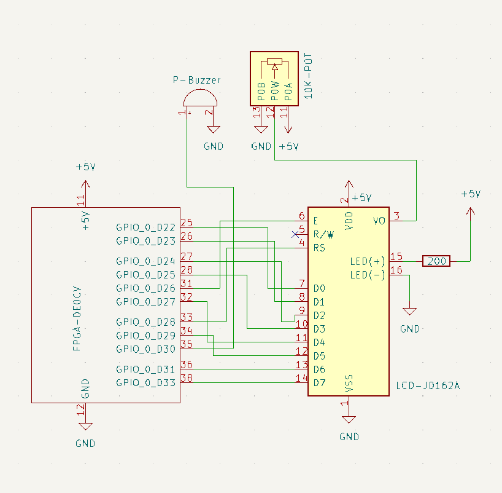

```text
             _____   ________ __________  ____________________          
            /     \  \_____  \\______   \/   _____/\_   _____/          
  ______   /  \ /  \  /   |   \|       _/\_____  \  |    __)_    ______ 
 /_____/  /    Y    \/    |    \    |   \/        \ |        \  /_____/ 
          \____|__  /\_______  /____|_  /_______  //_______  /          
                  \/         \/       \/        \/         \/           
     _____      _____  _________   ___ ___ .___ _______  ___________    
    /     \    /  _  \ \_   ___ \ /   |   \|   |\      \ \_   _____/    
   /  \ /  \  /  /_\  \/    \  \//    ~    \   |/   |   \ |    __)_     
  /    Y    \/    |    \     \___\    Y    /   /    |    \|        \    
  \____|__  /\____|__  /\______  /\___|_  /|__\____|__  /_______  /    
          \/         \/        \/       \/             \/        \/     
```

# Morse Code FPGA Decoder

This FPGA project decodes Morse code input from a button and displays the text on a 16x2 LCD. It features support for letters, numbers, and special symbols, along with a passive buzzer for audio feedback.

## Features
- **Morse Decoder:** Detects dots (short press) and dashes (long press) with automatic character spacing.
- **Display:** 16x2 LCD support (2-line mode).
- **Controls:**
  - **Morse Key:** Input Morse code.
  - **Clear:** Clears the display.
  - **Space:** Adds a space character.
  - **Enter:** Moves cursor to the next line (toggles between Line 1 and Line 2).
- **Feedback:**
  - **Buzzer:** 1kHz tone synchronized with button presses.
  - **LEDs:** Visual debugging for button state, decoding status, and current line.

## Hardware Requirements
- **FPGA Board:** Terasic DE0-CV (Cyclone V) or compatible.
- **Display:** JHD 162A or HD44780 compatible LCD.
- **Input:** Push buttons (Active Low).
- **Audio:** Passive buzzer.
- **Software:** Quartus Prime 18.1.

## Schematic & Connections


## Documentation & Datasheets
- [DE0-CV User Manual](https://www2.pcs.usp.br/~labdig/material/DE0_CV_User_Manual.pdf)
- [JHD162A LCD Datasheet](https://www.rhydolabz.com/documents/display/JHD162A.pdf)

## Simulation with ModelSim

To simulate the design and see the decoded characters in the waveform viewer:

1.  **Open ModelSim-Altera.**
2.  **Create a New Project** and add the following files:
    - `lcd_controller.vhd`
    - `lcd_top.vhd`
    - `tb_lcd_morse.vhd`
3.  **Compile All** files. Ensure there are no errors.
4.  **Start Simulation:**
    - Go to `Simulate` -> `Start Simulation`.
    - Expand the `work` library and select `tb_lcd_morse`.
    - Click OK.
5.  **Add Waves (CRITICAL STEP):**
    - In the **"sim"** or **"Structure"** window (top left), click directly on the name **`tb_lcd_morse`**.
    - Now look at the **"Objects"** window (middle pane). You will see a signal named **`lcd_char_view`**.
    - Right-click `lcd_char_view` and select **Add to -> Wave -> Selected Signals**.
    - You can also add other signals from `uut` if you want to see the hardware internal states.
6.  **Run Simulation:**
    - Type `run 2 sec` in the transcript window (or press the Run All button).
7.  **Analyze:**
    - In the Wave window, look for `lcd_char_view`. It will show readable characters like 'A', 'B', 'C' as they are sent to the LCD.
    - Check the console output ("Transcript") for text reports like `report "LCD WRITE: 'A'"` for real-time logging.

# Morse-kodtabell

## Alfabet
| Bokstav | Morse   | Bokstav | Morse   | Bokstav | Morse   |
|---------|---------|---------|---------|---------|---------|
| A       | .-      | K       | -.-     | U       | ..-     |
| B       | -...    | L       | .-..    | V       | ...-    |
| C       | -.-.    | M       | --      | W       | .--     |
| D       | -..     | N       | -.      | X       | -..-    |
| E       | .       | O       | ---     | Y       | -.--    |
| F       | ..-.    | P       | .--.    | Z       | --..    |
| G       | --.     | Q       | --.-    | Å       | .--.-   |
| H       | ....    | R       | .-.     | Ä       | .-.-    |
| I       | ..      | S       | ...     | Ö       | ---     |
| J       | .---    | T       | -       |         |         |

---

## Siffror
| Siffra | Morse    | Siffra | Morse    | Siffra | Morse    |
|--------|----------|--------|----------|--------|----------|
| 1      | .----    | 4      | ....-    | 7      | --...    |
| 2      | ..---    | 5      | .....    | 8      | ---..    |
| 3      | ...--    | 6      | -....    | 9      | ----.    |
| 0      | -----    |        |          |        |          |

---

## Specialtecken & Signaler
| Tecken        | Morse      | Tecken         | Morse        |
|---------------|------------|----------------|--------------|
| Punkt (.)      | .-.-.-     | Apostrof (")   | .----.        |
| Komma (,)      | --..--     | Kolon (:)      | ---...        |
| Parentes (     | -.--.      | Parentes )     | -.--.-        |
| Bindestreck (-)| -....-     | Citat (")      | .-..-.        |
| Åtskillnad (=) | -...-      | Förstått       | ...-.         |
| Lystring       | -.-.-      | Exp slut (VA)  | ..-.-         |
| Vänta (AS)     | .-...      | Nöd (SOS)      | ...---...     |
| Sluttecken (+) | .-.-.      | Repetition (x) | -- --         |
| Felskrivning    | ........   | Verkställ (IX) | ..-..-        |