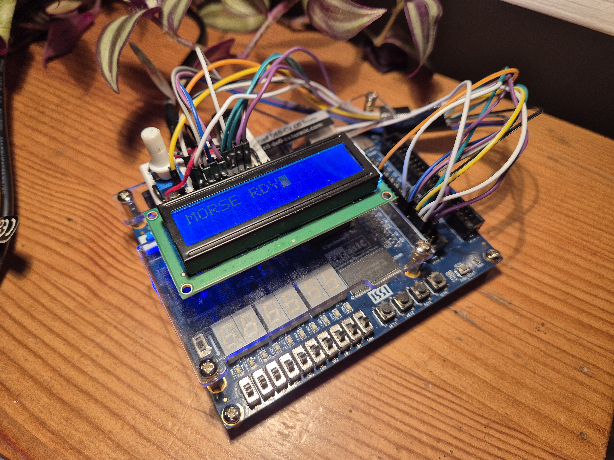

# FPGA-baserad Morseavkodare
**Projektrapport: Digital Systemkonstruktion med VHDL**

## 1. Inledning
Syftet med detta projekt är att konstruera en robust, hårdvarubaserad morseavkodare med hjälp av en FPGA (Field-Programmable Gate Array). Systemet tar emot signaler från en tryckknapp, analyserar signalens längd i realtid och översätter dessa till läsbar text på en LCD-display. Projektet demonstrerar grundläggande principer inom digital design såsom tillståndsmaskiner (FSM), timers, signalbehandling (avstudsning) och protokollhantering för extern hårdvara.

## 2. Hårdvara och Komponenter
Systemet är uppbyggt kring följande komponenter:

| Komponent | Modell/Typ | Funktion |
| :--- | :--- | :--- |
| **FPGA-kort** | Terasic DE0-CV (Cyclone V) | Systemets hjärna som hanterar all logik. |
| **Display** | JHD 162A (16x2 LCD) | Visar den avkodade texten (två rader). |
| **Input** | Tryckknapp (Active Low) | Används för att mata in morsekod (punkt/streck). |
| **Audio** | Passiv Summer (Buzzer) | Ger ljudåterkoppling vid knapptryckning (1 kHz ton). |
| **Gränssnitt** | GPIO (General Purpose I/O) | Kopplar samman FPGA med LCD och summer. |

---

## 3. Teknisk Implementering

### 3.1 Signalbehandling och Timing
För att skilja på en punkt (dot) och ett streck (dash) använder systemet en intern räknare baserad på FPGA:ns 50 MHz-klocka.

*   **Brusreducering (Debounce):** För att undvika felaktiga signaler från mekaniska knappar ignoreras alla signaler kortare än **20 ms**.
*   **Punkt (.)**: En tryckning kortare än **0,25 sekunder**.
*   **Streck (-)**: En tryckning längre än **0,25 sekunder**.
*   **Teckenpaus**: Om ingen signal ges på **0,60 sekunder**, tolkas den inmatade sekvensen som ett färdigt tecken och skickas till displayen.

### 3.2 Ljudåterkoppling (PWM)
För att ge användaren direkt respons genererar systemet en PWM-signal (Pulse Width Modulation) till summern. Signalen har en frekvens på ca **1 kHz**, vilket skapas genom att toggla en utgång var 25 000:e klockcykel när knappen är nedtryckt.

### 3.3 LCD-kontroller
En dedikerad VHDL-modul (`lcd_controller.vhd`) hanterar den komplexa initialiseringen av LCD-skärmen. Displayen är konfigurerad i **2-raders läge (kommando 0x38)**, vilket möjliggör skrivning på både övre och undre raden.

---

## 4. Användarmanual
Systemet styrs via fyra knappar definierade i logiken:

| Knappfunktion | Beskrivning |
| :--- | :--- |
| **Morse Key** | Huvudknapp för inmatning. Kort tryck = Punkt, Långt tryck = Streck. |
| **Space** | Infogar ett mellanslag på displayen. |
| **Enter (Ny rad)** | Flyttar markören mellan rad 1 och rad 2. |
| **Clear** | Rensar hela displayen och återställer markören till början. |

---

## 5. Morse-referenstabell
Systemet stödjer fullständigt alfabet (A-Z), siffror (0-9) samt vanliga specialtecken.

### Bokstäver
| Tecken | Kod | Tecken | Kod | Tecken | Kod |
| :---: | :--- | :---: | :--- | :---: | :--- |
| **A** | `.-` | **J** | `.---` | **S** | `...` |
| **B** | `-...` | **K** | `-.-` | **T** | `-` |
| **C** | `-.-.` | **L** | `.-..` | **U** | `..-` |
| **D** | `-..` | **M** | `--` | **V** | `...-` |
| **E** | `.` | **N** | `-.` | **W** | `.--` |
| **F** | `..-.` | **O** | `---` | **X** | `-..-` |
| **G** | `--.` | **P** | `.--.` | **Y** | `-.--` |
| **H** | `....` | **Q** | `--.-` | **Z** | `--..` |
| **I** | `..` | **R** | `.-.` | | |

### Siffror
| Siffra | Kod | Siffra | Kod |
| :---: | :--- | :---: | :--- |
| **1** | `.----` | **6** | `-....` |
| **2** | `..---` | **7** | `--...` |
| **3** | `...--` | **8** | `---..` |
| **4** | `....-` | **9** | `----.` |
| **5** | `.....` | **0** | `-----` |

---

## 6. Slutsats
Projektet har resulterat i en fullt fungerande morseavkodare. Genom att implementera robusta filter för insignaler och tydlig visuell samt auditiv återkoppling, är systemet både lärorikt och användarvänligt. Koden är modulär, vilket gör det enkelt att i framtiden utöka funktionaliteten, exempelvis med stöd för snabbare inmatningshastighet (WPM) eller fler specialtecken.
